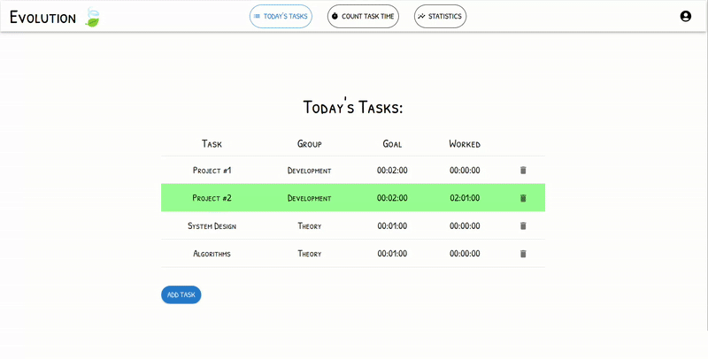

# Evolution

## About The Project

Evolution is a full-stack productivity application that integrates a To-Do list with a Stopwatch feature. It enables users to track the time invested in each daily activity, making it an excellent tool to monitor and improve productivity.

Below are demonstration GIFs showcasing the task list, stopwatch functionality, and historical data tracking:




## Main Technologies

- React
- Java Spring Boot
- PostgreSQL
- Docker


## Features Implemented

- Users can add multiple tasks for the day and assign a goal time for each activity to set time dedication targets.
- The Stopwatch allows users to track the actual time spent working on each task.
- The main page displays the accumulated work time for the current day across all tasks.
- The Statistics section shows user progress with and an all-time productivity record


## Prerequisites

To run this project, make sure you have **Docker** installed. You can find the installation instructions here:

- [Docker Documentation](https://docs.docker.com/)


## Getting Started

1. **Clone the repository:**


```bash
   git clone https://github.com/tiagooc93/evolution
   cd evolution
```

2. **Set up environment variables:**

Then you'll need to create a .env file with configurations. For simplicity, i put a .env.example on the repo, so you'll just need to copy it into the .env with the following command:

```bash
cp .env.example .env
```

3. **Start the application with Docker Compose:**


Then use docker to run the whole project based on the docker-compose configuration file.

```bash
sudo docker-compose up
```

## Usage

By default, the services will be accessible at:

    Frontend: http://localhost:3000

    Backend: http://localhost:8080
    
Just open your browser and visit:

```bash
localhost:3000/
``````


